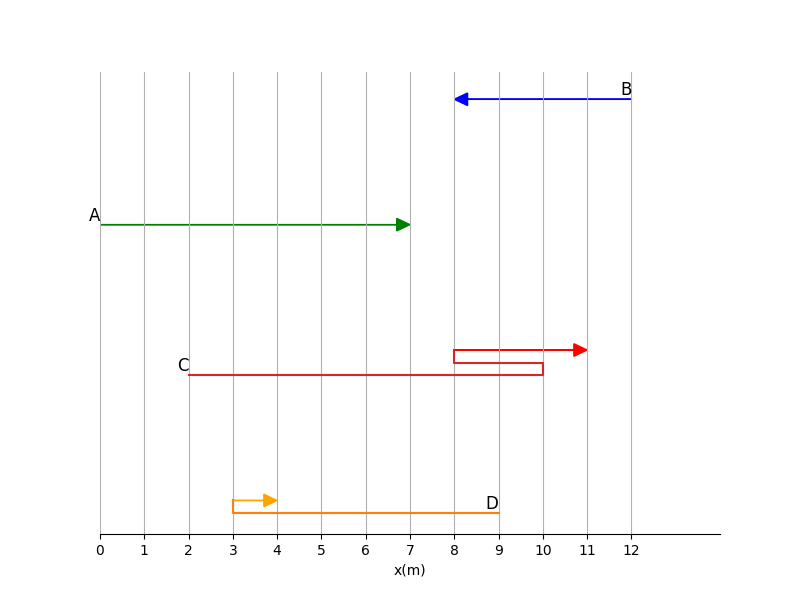

# Chương 02: Động học

## 2.1. Độ dịch chuyển

### Câu hỏi 2.1.1 - Easy 
> Translate from [Q1](https://openstax.org/books/college-physics-ap-courses-2e/pages/2-problems-exercises)

Tìm các thông tin sau cho đường đi A trong hình dưới

**(a)** Quãng đường đã đi

**(b)** Độ lớn của độ dịch chuyển từ điểm đầu đến điểm cuối

**(c)** Độ dịch chuyển từ điểm đầu đến điểm cuối

#### Đáp án 2.1.1

**(a)** [7] m

**(b)** [7] m

**(c)** [+7] m

### Câu hỏi 2.1.2 - Easy
> Translate from [Q2](https://openstax.org/books/college-physics-ap-courses-2e/pages/2-problems-exercises)

Tìm các thông tin sau cho đường đi B trong hình dưới

**(a)** Quãng đường đã đi

**(b)** Độ lớn của độ dịch chuyển từ điểm đầu đến điểm cuối

**(c)** Độ dịch chuyển từ điểm đầu đến điểm cuối

#### Đáp án 2.1.2:

**(a)** [4] m

**(b)** [4] m

**(c)** [-4] m

### Câu hỏi 2.1.3 - Easy
> Translate from [Q3](https://openstax.org/books/college-physics-ap-courses-2e/pages/2-problems-exercises)

Tìm các thông tin sau cho đường đi C trong hình dưới:

**(a)** Quãng đường đã đi

**(b)** Độ lớn của độ dịch chuyển từ điểm đầu đến điểm cuối

**(c)** Độ dịch chuyển từ điểm đầu đến điểm cuối

#### Đáp án 2.1.3:

**(a)** [13] m

**(b)** [9] m

**(c)** [9] m

### Câu hỏi 2.1.4 - Easy
> Translate from [Q4](https://openstax.org/books/college-physics-ap-courses-2e/pages/2-problems-exercises)

Tìm các thông tin sau cho đường đi D trong hình dưới:

**(a)** Quãng đường đã đi

**(b)** Độ lớn của độ dịch chuyển từ điểm đầu đến điểm cuối

**(c)** Độ dịch chuyển từ điểm đầu đến điểm cuối

#### Đáp án 2.1.4:

**(a)** [7] m

**(b)** [5] m

**(c)** [-5] m

### Câu hỏi 2.1.5 - Easy

Một người đi bộ bắt đầu từ điểm A, đi 5 mét về phía Đông đến điểm B, sau đó quay lại đi 3 mét về phía Tây đến điểm C. Khi đó:

(A) Quãng đường đi được là 2 mét, độ dịch chuyển là 2 mét về phía Đông, và độ lớn của độ dịch chuyển là 2 mét

(B) Quãng đường đi được là 8 mét, độ dịch chuyển là 2 mét về phía Đông, và độ lớn của độ dịch chuyển là 2 mét

(C) Quãng đường đi được là 8 mét, độ dịch chuyển là 8 mét về phía Tây, và độ lớn của độ dịch chuyển là 8 mét

(D) Quãng đường đi được là 2 mét, độ dịch chuyển là 8 mét về phía Tây, và độ lớn của độ dịch chuyển là 8 mét

#### Đáp án 2.1.5:

(B)
 
### Câu hỏi 2.1.6 - Easy:

Trong trường hợp nào dưới đây thì quãng đường đi được bằng độ lớn của độ dịch chuyển?

(A) Khi vật chuyển động theo đường cong và đổi hướng liên tục.

(B) Khi vật đứng yên tại một chỗ.

(C) Khi vật chuyển động thẳng theo một hướng duy nhất.

(D) Khi vật chuyển động thẳng nhưng sau đó quay trở lại vị trí ban đầu.

#### Đáp án 2.1.6:

(C)

### Câu hỏi 2.1.7 - Easy:

Vi khuẩn di chuyển tới lui bằng cách sử dụng tiên mao (bộ phận tương tự chiếc đuôi nhỏ). Tốc độ quan sát được là $50\mu m/s\ (50 * 10^{-6} m/s)$. Tổng quãng đường đi được của một vi khuẩn rất lớn so với kích thước của nó, trong khi độ dịch chuyển của nó lại nhỏ. Tại sao lại như vậy?

(A) Vì vi khuẩn di chuyển với tốc độ rất cao trong một khoảng thời gian ngắn.

(B) Vì vi khuẩn thường xuyên thay đổi hướng di chuyển, dẫn đến nhiều đoạn đường nhỏ cộng lại thành quãng đường lớn, nhưng vị trí cuối cùng không cách xa vị trí ban đầu.

(C) Vì roi của vi khuẩn có chiều dài lớn hơn nhiều so với kích thước của thân vi khuẩn.

(D) Vì vi khuẩn di chuyển theo đường thẳng ra rất xa.

#### Đáp án 2.1.7:

(B)

## 2.2. Thời gian, vận tốc, và tốc độ

### Câu hỏi 2.2.1 - Easy
> Translate from [Q5](https://openstax.org/books/college-physics-ap-courses-2e/pages/2-problems-exercises)

Biết khoảng cách từ Trái Đất đến Mặt Trời là 150 triệu km $(1.5 * 10^8\ km)$

(a) Tính tốc độ trung bình của Trái Đất so với Mặt Trời.

(b) Vận tốc trung bình của Trái Đất trong khoảng thời gian một năm là bao nhiêu?

#### Đáp án

(a) [3.0 * 10^4] m/s

(b) [0] m/s

### Câu 2.2.2 - Easy

> Translate from [Q7](https://openstax.org/books/college-physics-ap-courses-2e/pages/2-problems-exercises)

Các lục địa Bắc Mỹ và châu Âu đang trôi dạt xa nhau với tốc độ khoảng 3 cm/năm. Với tốc độ này, mất bao lâu để chúng trôi dạt xa nhau thêm 500 km so với khoảng cách hiện tại?

#### Đáp án
[2 * 10^7] năm

### Câu 2.2.3 - Medium
> Translate from [Q9](https://openstax.org/books/college-physics-ap-courses-2e/pages/2-problems-exercises)

Vào ngày 26 tháng 5 năm 1934, đoàn tàu Zephyr, một đoàn tàu diesel làm bằng thép không gỉ, đã lập kỷ lục thế giới về tốc độ di chuyển trên đoạn đường dài không ngừng nghỉ cho tàu hỏa. Chuyến đi của nó từ Denver đến Chicago mất 13 giờ, 4 phút, 58 giây và được chứng kiến bởi hơn một triệu người dọc theo tuyến đường. Tổng quãng đường đi được là 1633,8 km. 
Tốc độ trung bình của nó là bao nhiêu theo km/h và m/s?

#### Đáp án

[124.88] km/h và [34.689] m/s

### Câu 2.2.4 - Medium

> Translate from [Q11](https://openstax.org/books/college-physics-ap-courses-2e/pages/2-problems-exercises)

Một sinh viên lái xe từ nhà đến trường đại học và thấy công tơ mét (thiết bị đo khoảng cách trên xe) đã tăng thêm 12 km. Chuyến đi mất 18 phút.

(a) Tốc độ trung bình của chuyến đi là bao nhiêu?

(b) Nếu khoảng cách theo đuờng chim bay từ nhà đến trường đại học là 10,3 km theo hướng $25\degree$ về phía đông nam, thì vận tốc trung bình của chuyến đi là bao nhiêu?

(c) Nếu anh sinh viên trở về nhà theo cùng con đường đó sau 7 giờ 30 phút kể từ khi rời đi, thì tốc độ trung bình và vận tốc trung bình cho toàn bộ chuyến đi là bao nhiêu?

#### Đáp án

(a) [40.0] km/h
 
(b) [34.3] km/h, [25]$\degree$ đông nam 

(c) Tốc độ trung bình = [3.20] km/h, vận tốc trung bình = [0] km/h

### Câu 2.2.5 - Medium

> Translate from [Q13](https://openstax.org/books/college-physics-ap-courses-2e/pages/2-problems-exercises)

Khi các phi hành gia trò chuyện trên bề mặt Mặt Trăng, các cuộc trò chuyện thường bị ảnh hưởng bởi tiếng vọng, trong đó giọng nói của người ở Trái Đất quá lớn trong mũ bảo hiểm không gian của phi hành gia đến nỗi nó bị micro của phi hành gia thu lại và truyền trở lại Trái Đất. Bỏ qua độ trễ khi xử lý các tín hiệu điện tử, thời gian vọng lại (thời gian kể từ khi người ở Trái Đất nói vào micro và nhận lại được tiếng vọng) bằng thời gian sóng vô tuyến đi từ Trái Đất đến Mặt Trăng và trở lại. Tính khoảng cách từ Trái Đất đến Mặt Trăng, biết rằng thời gian vọng là 2,56 s và sóng vô tuyến truyền đi với tốc độ ánh sáng $3.00*10^8\ m/s$.

#### Đáp án 2.2.5:

[384000]km

### Câu 2.2.6 - Medium

> Translate from [Q15](https://openstax.org/books/college-physics-ap-courses-2e/pages/2-problems-exercises)

Theo mô hình hành tinh của nguyên tử, electron quay quanh hạt nhân nguyên tử giống như các hành tinh quay quanh Mặt Trời. Trong mô hình này, bạn có thể xem hydro, nguyên tử đơn giản nhất, có một electron duy nhất trong quỹ đạo tròn với đường kính $1.06*10^{−10}m$

(a) Nếu tốc độ trung bình của electron trong quỹ đạo này là $2.20*10^6\ m/s$, hãy tính số vòng quay mỗi giây mà electron thực hiện quanh hạt nhân.

(b) Vận tốc trung bình của electron trong mỗi vòng quay là bao nhiêu?
#### Đáp án
(a) [6.61 * 10^15] vòng/s

(b) [0] m/s

### Câu 2.2.7 - Easy
Một học sinh viết: “Một con chim đang lao xuống để bắt mồi có tốc độ là −10 m/s.” Điều gì sai với phát biểu của học sinh này? Học sinh này thực tế đã mô tả điều gì? Giải thích.

**(A)** Phát biểu sai vì tốc độ không thể là số âm. Học sinh đã mô tả vận tốc của con chim theo một hệ tọa độ nhất định. 

**(B)** Phát biểu sai vì vận tốc không thể là số âm. Học sinh đã mô tả quãng đường con chim bay được. 

**(C)** Phát biểu sai vì gia tốc không thể là số âm. Học sinh đã mô tả vận tốc của con chim. 

**(D)** Phát biểu sai vì độ dịch chuyển không thể là số âm. Học sinh đã mô tả tốc độ của con chim.

#### Đáp án
(A)

### Câu 2.2.8 - Easy
Gia tốc là sự thay đổi vận tốc theo thời gian. Dựa trên thông tin này, gia tốc là đại lượng vector hay đại lượng vô hướng? Giải thích.

**(A)** Gia tốc là đại lượng vô hướng vì nó được tính bằng cách chia độ lớn của vận tốc cho thời gian. 

**(B)** Gia tốc là đại lượng vô hướng vì thời gian là đại lượng vô hướng. 

**(C)** Gia tốc là đại lượng vector vì nó liên quan đến sự thay đổi của vận tốc, mà vận tốc là một đại lượng vector. 

**(D)** Gia tốc không phải là vector cũng không phải là vô hướng.

#### Đáp án
(C)

### Câu 2.2.9 - Easy
Một dự báo thời tiết nói rằng nhiệt độ dự kiến vào ngày hôm sau là −5ºC. Nhiệt độ này là đại lượng vector hay đại lượng vô hướng? Giải thích.

**(A)** Nhiệt độ là đại lượng vector vì nó có thể có giá trị âm, chỉ hướng của sự thay đổi nhiệt. 

**(B)** Nhiệt độ là đại lượng vector vì nó được đo bằng một thang đo có hướng. 

**(C)** Nhiệt độ là đại lượng vô hướng vì nó chỉ có độ lớn (mức độ nóng hay lạnh) và không có hướng liên quan đến không gian. 

**(D)** Nhiệt độ không phải là vector cũng không phải là vô hướng.

#### Đáp án
(C)

## 2.3. Thời gian, Vận tốc, và Tốc độ

### Câu 2.3.1 - Easy
Trong ví dụ nào dưới đây, thiết bị nào được sử dụng để đo thời gian và sự thay đổi nào trong thiết bị đó cho thấy sự thay đổi của thời gian

**(A)** Nhiệt kế. Sự thay đổi về chiều dài của cột chất lỏng cho thấy sự thay đổi của thời gian. 

**(B)** Cân. Sự thay đổi về vị trí của kim chỉ hoặc số hiển thị cho thấy sự thay đổi của thời gian. 

**(C)** Đồng hồ cát. Sự thay đổi về lượng cát chảy từ bình trên xuống bình dưới cho thấy sự thay đổi của thời gian. 

**(D)** La bàn. Sự thay đổi về hướng của kim từ cho thấy sự thay đổi của thời gian.

#### Đáp án
(C)

### Câu 2.3.2 - Easy
**Tốc độ trung bình và độ lớn của vận tốc trung bình là hai khái niệm khác nhau. Tình huống nào sau đây thể hiện rõ sự khác biệt giữa hai đại lượng này?**

**(A)** Một chiếc ô tô đi trên đường thẳng với tốc độ không đổi 50 km/h trong 1 giờ. 

**(B)** Một người đi bộ đi 10 mét về phía bắc trong 5 giây, sau đó đứng yên trong 5 giây tiếp theo. 

**(C)** Một vận động viên chạy bộ trên đường đua hình tròn có chu vi 400 mét và hoàn thành một vòng trong 60 giây. 

**(D)** Một chiếc máy bay bay theo đường thẳng từ thành phố A đến thành phố B với vận tốc không đổi 800 km/h.

#### Đáp án
(C)

### Câu 2.3.3 - Easy
**Mối quan hệ và sự khác biệt giữa vận tốc tức thời và tốc độ tức thời được mô tả chính xác nhất trong phát biểu nào sau đây?**

**(A)** Vận tốc tức thời là độ lớn của tốc độ tức thời và luôn có cùng hướng.

**(B)** Tốc độ tức thời là một đại lượng vector, còn vận tốc tức thời là một đại lượng vô hướng. 

**(C)** Tốc độ tức thời là độ lớn của vận tốc tức thời, trong khi vận tốc tức thời bao gồm cả độ lớn và hướng.

**(D)** Vận tốc tức thời và tốc độ tức thời là hai đại lượng hoàn toàn độc lập và không liên quan đến nhau.

#### Đáp án
(C)
## 2.4. Gia tốc

### Câu 2.4.1 - Easy

> Translate from [Q16](https://openstax.org/books/college-physics-ap-courses-2e/pages/2-problems-exercises)

Một con báo có thể tăng tốc từ trạng thái đứng yên lên tốc độ 30,0 m/s trong 7,00 s. Gia tốc của nó là bao nhiêu?
#### Đáp án
[4.29] $m/s^2$

### Câu 2.4.2 - Easy
> Translate from [Q18](https://openstax.org/books/college-physics-ap-courses-2e/pages/2-problems-exercises)

Một người lái xe lùi ô tô ra khỏi ga ra với gia tốc 1.40m/s2.

**(a)** Mất bao lâu để cô ấy đạt được tốc độ 2.00m/s?

**(b)** Nếu sau đó cô ấy phanh để dừng lại trong 0.800s, thì độ giảm tốc của cô ấy là bao nhiêu?
#### Đáp án
**(a)** [1.43]s

**(b)** [-2.50] $m/s^2$

### Câu 2.4.3 - Easy
> Translate from [Q17](https://openstax.org/books/college-physics-ap-courses-2e/pages/2-problems-exercises)

Tiến sĩ John Paul Stapp là một sĩ quan không quân Mỹ. Ông đã nghiên cứu tác động của sự giảm tốc cực độ lên cơ thể con người. Vào ngày 10 tháng 12 năm 1954, Stapp đi trên một chiếc xe trượt có gắn tên lửa, tăng tốc từ trạng thái đứng yên lên tốc độ tối đa 282 m/s (1015 km/h) trong 5,00 s, và sau đó bị dừng lại một cách đột ngột chỉ trong 1,40 s! Tính (a) gia tốc và (b) độ giảm tốc của ông ấy. Biểu diễn mỗi giá trị theo bội số của gia tốc trọng trường g. Biết $g = 9.80m/s^2$
#### Đáp án
(a) Gia tốc: [5.76]g

(b) Độ giảm tốc: [20.55]g

### Câu 2.4.4 - Easy
**Chọn hướng bên phải là chiều dương, một đoàn tàu điện ngầm đang di chuyển về bên trái (có vận tốc âm) và sau đó dừng lại. Hướng và dấu của gia tốc của đoàn tàu là gì?**

**(A)** Gia tốc hướng về bên trái và là âm. 

**(B)** Gia tốc hướng về bên phải và là dương. 

**(C)** Gia tốc bằng không vì đoàn tàu dừng lại. 

**(D)** Không thể xác định hướng và dấu của gia tốc nếu chỉ biết vận tốc ban đầu và trạng thái dừng cuối cùng.

#### Đáp án
(B)

## 2.5. Phương trình chuyển động một chiều với gia tốc không đổi

### Câu 2.5.1 - Easy
> Translate from [Q20](https://openstax.org/books/college-physics-ap-courses-2e/pages/2-problems-exercises)

> This question has a graphical analysis problem, but cannot be done yet due to technical limitation. TODO: Check this

Một vận động viên chạy nước rút Olympic bắt đầu cuộc đua với gia tốc $4.50m/s^2$. Tốc độ của cô ấy sau 2,40 s là bao nhiêu?

#### Đáp án:
[10.8] m/s

### Câu 2.5.2 - Easy
Một quả bóng chày ném đi được bắt lại bởi găng tay đệm dày. Nếu độ giảm tốc của quả bóng là $2.10×10^4m/s^2$, và thời gian từ khi quả bóng chạm găng tay lần đầu tiên cho đến khi dừng lại là $1.85 ms$ $(1ms=10^{−3}s)$, thì vận tốc ban đầu của quả bóng là bao nhiêu?

#### Đáp án
38.9 m/s

### Câu 2.5.3 - Easy
**(a)** Một đoàn tàu chở khách hạng nhẹ tăng tốc với gia tốc $1.35m/s^2$. Mất bao lâu để nó đạt được tốc độ tối đa $80.0km/h$, bắt đầu từ trạng thái đứng yên?

**(b)** Cùng đoàn tàu đó thường giảm tốc với gia tốc $1.65m/s^2$. Mất bao lâu để nó dừng lại từ tốc độ tối đa?

**(c)** Trong trường hợp khẩn cấp, tàu có thể giảm tốc nhanh hơn, dừng lại từ $80.0km/h$ trong 8.30s. Chọn chiều dương là chiều tàu đang chạy, gia tốc khi dừng khẩn cấp của nó là bao nhiêu theo đơn vị $m/s^2$?

#### Đáp án
(a) [16.5] s

(b) [13.5] s

(c) [−2.68] $m/s^2$

